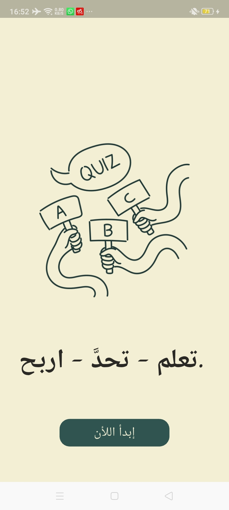
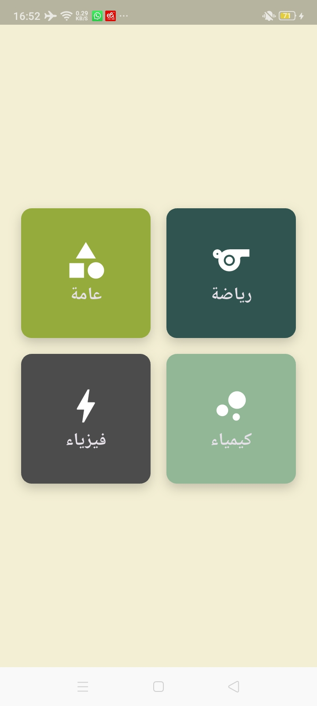
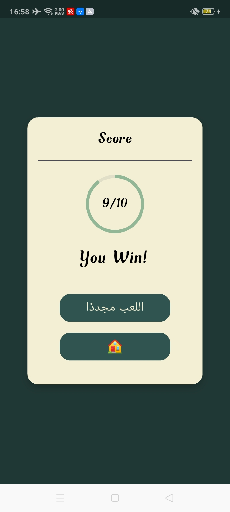
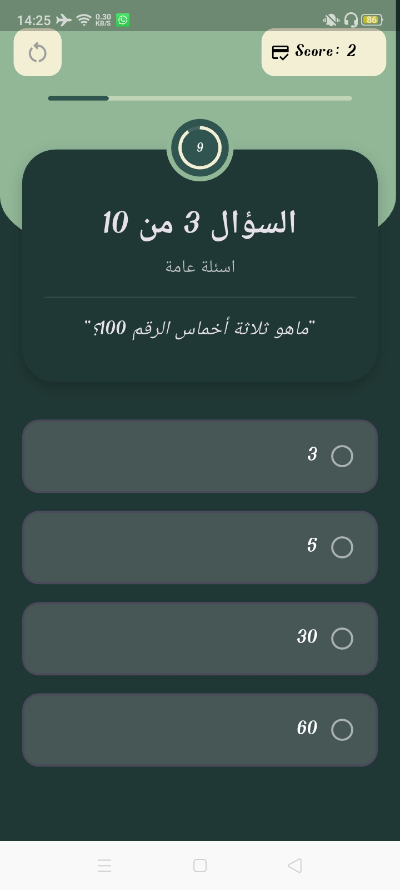
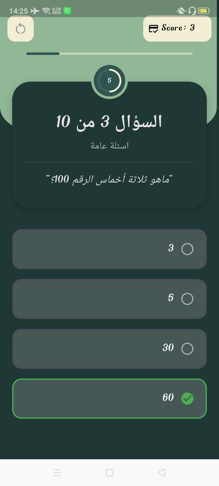
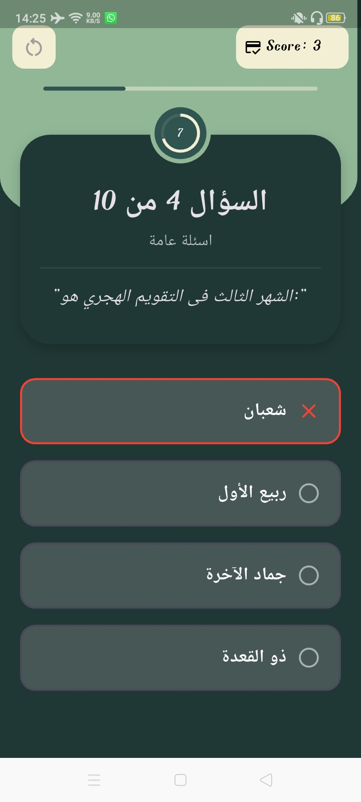

# Quiz Game

A feature-rich quiz mobile application built with **Flutter**.  
The app provides category-based quizzes, real-time question loading from Firestore, state management with Cubit, and a countdown timer for each question.

---

## 📌 Features

- Category-based quiz questions
- Questions stored and fetched from **Firebase Firestore**
- State management using **Cubit**
- Track selected answer state (correct/incorrect)
- 10-second countdown timer per question
- Smooth navigation between questions
- Clean and responsive user interface

---

## 🛠️ Technologies Used

- **Flutter**
- **Dart**
- **Firebase Firestore** (Cloud NoSQL database)
- **Flutter Bloc (Cubit)** for state management
- Material Components

---

## Project Structure
📦 **lib/**  
 ├──📂 **core/**  
 ├── **cubit/**  
 │    ├── quiz_cubit.dart  
 │    └── quiz_state.dart  
 ├──📂 **models/**  
 │    └── question_model.dart  
 ├──📂 **servuces/**  
 │    └── firestore_service.dart  
 ├──📂 **screens/**  
 │    ├── home_screen.dart  
 │    ├── quiz_screen.dart  
 │    └── result_screen.dart  
 └──📂 **widgets/**  

---

## 🔥 How It Works

### **1. Categories**
Each quiz category has its own collection in Firestore.  
Example:

 **firestore**  
 ┣  **quizzes/**  
 ┃ ┣  chemistry/  
 ┃ ┃ ┗  questions/  
 ┃ ┣  general/  
 ┃ ┃ ┗  questions/  
 ┃ ┣  physics/  
 ┃ ┃ ┗  questions/   
 ┃ ┣  sports/  
 ┃ ┃ ┗  questions/     
 
Questions are dynamically read based on the selected category.


### **2. State Management**
Cubit handles:
- Selected option  
- Locking answers  
- Showing correct/incorrect state  
- Advancing to the next question  
- Resetting states for each question  

### **3. Timer**
Each question has a **10-second timer** managed by a separate Cubit state.

If the timer ends:
- Selected option is auto-locked
- App moves to next question

---

## 🖼 App Preview

| Home Screen | Quizzes Screen | Score Screen |  
|:-----------:|:--------------:|:------------:|
|  |  |  |

--- 

| Quiz Screen | Correct Answer | Wrong Answer |  
|:-----------:|:--------------:|:------------:|
|  |  |  |

---

## 🚀 Getting Started

### 1. Clone the repository
```bash
git clone https://github.com/KarimaMahmoud626/Quiz-Game
```  

### 2. Navigate into the project
```bash 
cd Quiz-Game
```  

### 3. Install dependecies
```bash  
flutter pub get
```

### 4. Configure Firebase
Place google-services.json in:
android/app/

### 5. Run the application
```bash
flutter run
```  
